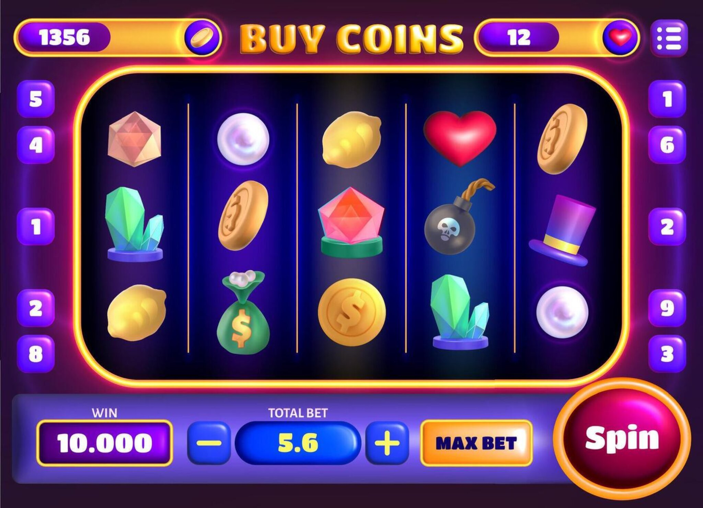
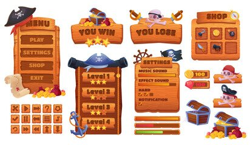
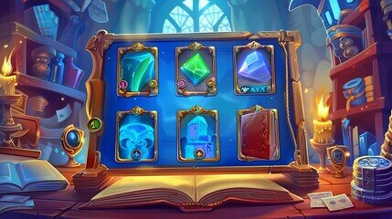
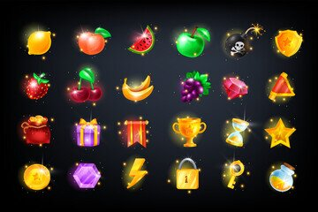

# Visual Theme Research

## Why Visual Theme/art designs Matters in Slot Machine Design
The visual theme of a slot machine game is crucial because it affects how the game feels, how easy it is to understand, and how memorable it is to users. A strong visual theme helps connect the reels, symbols, buttons, menus, and background into one consistent experience. It also helps the game look more polished instead of feeling random or unfinished. For this research, I looked and collected different reference images to understand what kinds of visual styles make slot machine games clear, appealing, and consistent.

## Reference Images

### Reference 1: Main Slot Machine Layout

This is the strongest reference for the overall gameplay screen. It shows the main slot layout, reel placement, color palette, and primary controls. Since this is the part of the game the user will look at most, it is the most important visual reference.

**What stands out:**  
- The spin button is very large and easy to notice, which makes the main action obvious.
- The reel area is placed in the center and is clearly the main focus.
- The win and bet controls are placed at the bottom, where players would expect them.

---

### Reference 2: Pirate-Themed UI Assets

This image shows how a visual theme can apply to menus, settings, shops, and buttons, not just the reel screen. It demonstrates full UI consistency within a pirate theme.

**What stands out:**  
- Buttons and menu panels match each other stylistically.
- The wooden textures, treasure chests, pirate hats, and anchors all support one clear theme.
- Decorative details make the UI feel more complete and less generic.

---

### Reference 3: Fantasy Slot Screen

This image is a good reference for environmental theming. It takes the slot machine idea and places it in a fantasy setting, using books, candles, magical objects, and jewelry symbols.

**What stands out:**  
- The symbols match the setting, which makes the design feel cohesive.
- The background creates a clear fantasy atmosphere.
- The theme gives the game a stronger identity.

---

### Reference 4: Glowing Icon Set

This image is the best reference for symbol design. Slot games rely on fast symbol recognition, so the icons need to be colorful, visually distinct, and easy to identify at a glance.

**What stands out:**  
- Each icon has a clear shape and silhouette.
- Bright highlights and glow effects make the symbols look rewarding and energetic.
- The icons are simple enough to read quickly.

## Main Patterns I Noticed
Across these images, several design patterns appeared repeatedly:

- the reel area is always the main visual focus
- strong contrast helps symbols stand out from the background
- large buttons improve usability and make actions clear

## This means our game should:
- keep the reels as the center of attention
- use a limited but vivid color palette
- have large and obvious controls
- use symbols with simple, recognizable shapes
- carry one consistent theme across gameplay and menus
  
## Takeaways
- The **main gameplay screen** should be the top visual priority.
- The **reels need to stay central and easy to read**.
- **Contrast** between the reel background and symbols is very important.
- **Large buttons** make the UI clearer and more user-friendly.
- A visual theme should apply to **menus, settings, and overlays**, not only the reels.
- **Symbols should be simple and distinct** so players can recognize them quickly.
- A stronger theme, such as pirate or fantasy, can make the game feel more original than a generic slot interface.

## Sources
https://stock.adobe.com/search?k=slot+game+ui 